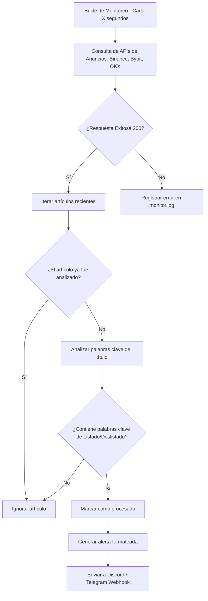

# Monitor de Listados y Deslistados de Criptomonedas (CEXs)

Este proyecto es una herramienta de monitoreo automatizado de baja latencia diseñada para rastrear de manera oportuna los anuncios oficiales de listados y deslistados de tokens en exchanges de criptomonedas líderes a nivel mundial (Binance, Bybit y OKX). Su objetivo es alertar a través de Discord y Telegram en tiempo real para capitalizar oportunidades de arbitraje, entradas y salidas de posiciones antes de que el mercado minorista absorba la información.

---

## 1. Justificación del Proyecto

En el trading y la inversión bursátil de activos digitales, la velocidad de información es el factor determinante del rendimiento. Cuando un gran exchange centralizado (CEX) anuncia la incorporación de un nuevo token a sus mercados, ocurre el fenómeno conocido como **"Listing Effect"** (Efecto Listado):
1.  **Pico de volatilidad alcista instantáneo:** En exchanges secundarios o plataformas de finanzas descentralizadas (DEXs) donde el token ya se comercializaba, el precio suele subir verticalmente en segundos.
2.  **Efecto Deslistado:** Un anuncio de eliminación de mercado (delisting) desploma el valor del token. Detectar esta señal de inmediato permite salvar posiciones abiertas o abrir posiciones cortas (shorting) defensivas.

Esta herramienta elimina la necesidad de monitoreo manual y reduce la latencia de respuesta a un nivel apto para trading algorítmico o toma de decisiones automatizada.

---

## 2. Alcance e Integración

*   **Fuentes de Monitoreo Directo:**
    *   **Binance Support API:** Consulta del backend de anuncios oficial (Categoría: Nuevos Listados).
    *   **Bybit Beehive API:** Acceso a anuncios en inglés y español.
    *   **OKX Support Feed:** Rastreo de comunicados de soporte técnico y listados de tokens.
*   **Canales de Notificación Soportados:**
    *   **Webhooks de Discord:** Alertas enriquecidas con formato enriquecido directo a canales específicos.
    *   **Bots de Telegram:** Envío de notificaciones inmediatas mediante la API de Telegram.

---

## 3. Lógica del Algoritmo (Cómo Funciona)



El script `monitor.py` funciona bajo un esquema de **bucle persistente de consulta (polling)**. Al inicializarse, realiza una carga inicial de los anuncios históricos para registrar sus IDs únicos e incluirlos en el conjunto `seen_articles` (evitando alertas duplicadas falsas). Posteriormente, analiza las palabras clave en busca de términos como *"will list"*, *"delisting"*, *"lists"*, *"listará"*, *"deslistará"* para clasificar el tipo de evento y enviar el mensaje.

---

## 4. Instalación y Uso

### Requisitos Previos
*   Python 3.8 o superior instalado.
*   Conexión a internet.

### 1. Clonar el repositorio e instalar dependencias
Si acabas de clonar este repositorio:
```bash
# Crear entorno virtual
python -m venv venv

# Activar entorno virtual (Windows)
.\venv\Scripts\activate

# Activar entorno virtual (Linux/macOS)
source venv/bin/activate

# Instalar dependencias
pip install -r requirements.txt
```

### 2. Configuración de Variables de Entorno
Copia el archivo de ejemplo `.env.example` y nómbralo `.env`:
```bash
cp .env.example .env
```
Abre el archivo `.env` en un editor de texto y rellena tus tokens y webhooks de destino:
*   `POLLING_INTERVAL`: Frecuencia de escaneo en segundos (valor recomendado: 5 a 10 para evitar rate-limits de IP).
*   `DISCORD_WEBHOOK_URL`: El webhook de tu canal de Discord.
*   `TELEGRAM_BOT_TOKEN`: El token secreto proporcionado por `@BotFather`.
*   `TELEGRAM_CHAT_ID`: Tu ID de chat de Telegram o el ID del grupo donde el bot es administrador.

### 3. Ejecutar el Monitor
```bash
python monitor.py
```
El script comenzará a ejecutarse en segundo plano e imprimirá los registros de monitoreo. Además, creará un archivo `monitor.log` en el mismo directorio para registrar cualquier error de red o apagado imprevisto.

---

## 5. Recomendaciones de Implementación y Producción

1.  **Evitar el Bloqueo de IPs (Rate Limits):** 
    Los servidores de exchanges bloquean solicitudes que parezcan ataques de denegación de servicio. No establezcas el `POLLING_INTERVAL` por debajo de 3 segundos a menos que utilices proxies rotativos o múltiples IPs.
2.  **Ubicación del Servidor:**
    Para minimizar el tiempo de recepción de la red (ping), despliega este script en una VPS cercana a los servidores de trading de Binance/Bybit. **AWS Frankfurt (eu-central-1)** o servidores en Europa Occidental son ideales.
3.  **Transición hacia el Arbitraje Automatizado:**
    Puedes extender la función `send_notification` dentro de `monitor.py` para llamar directamente a la API de tu exchange secundario favorito (mediante la librería `CCXT`) y colocar una orden de mercado de compra inmediatamente al detectar la señal de listado.
